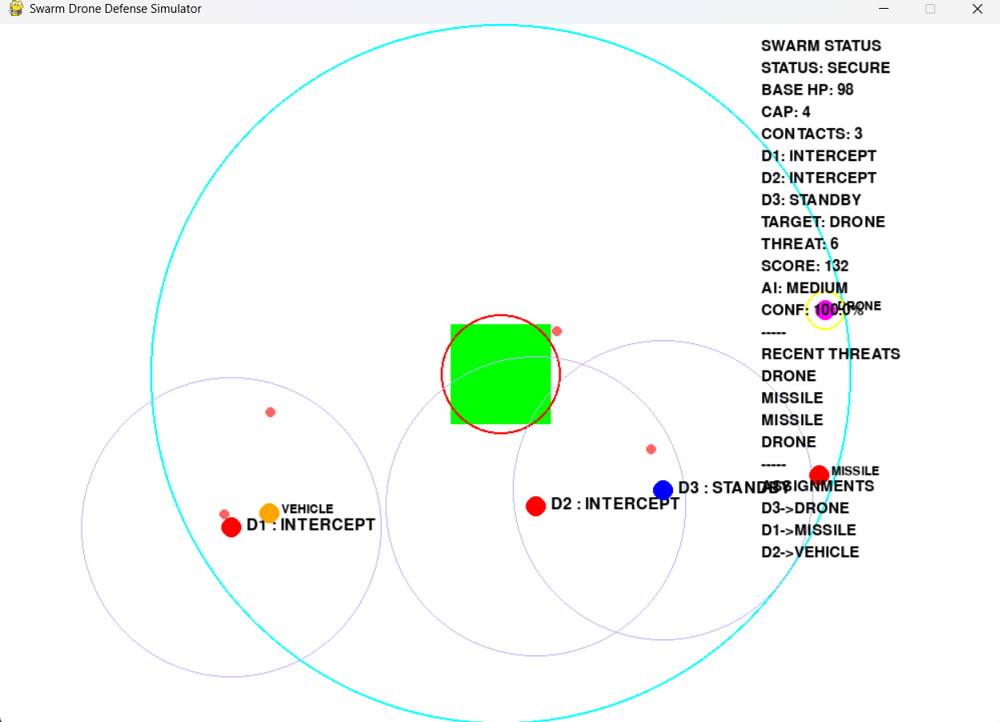

# Swarm Drone Defense Simulator

An AI-powered swarm defense simulation developed using Python, Pygame, and Machine Learning.

## Features

* Central Radar Detection System
* Autonomous Drone Swarm Coordination
* Machine Learning Threat Classification
* Dynamic Threat Prioritization
* Multi-Target Assignment Engine
* Real-Time Interception
* Base Defense Monitoring
* Threat Logging & Heatmap Visualization

## System Architecture

Central Radar → Threat Detection → ML Classification → Threat Prioritization → Drone Assignment → Interception

## Intruder Types

* Missile
* Vehicle
* Drone

## Technologies

* Python
* Pygame
* Scikit-Learn
* Pandas
* Joblib

## Current Capabilities

* Multi-drone autonomous defense
* Real-time target assignment
* Centralized radar-based detection
* Machine learning threat evaluation
* Dynamic swarm coordination
* Capture and respawn simulation

## Future Enhancements

* Predictive Interception
* Computer Vision Target Recognition
* Multi-Radar Networks
* Cooperative Swarm Formations
* Pixhawk Integration
* Real Drone Deployment

## Author

Swastik Singh

Electronics & Communication Engineering

PSIT Kanpur

## Simulation Preview

